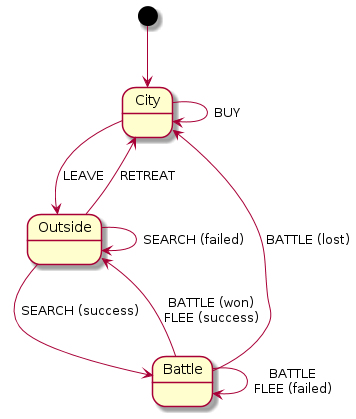

# DOCS

* [Architecture](#architecture)
  * [General Workflow](#general-workflow)
  * [Game States](#game-states)
* [Developer guide](#developer-guide)
  * [Coding](#coding)
    * [1. Use Typing](#1-use-typing)
    * [2. Naming and case](#2-naming-and-case)
    * [3. Imports and sub-modules](#3-imports-and-sub-modules)
  * [Testing](#testing)
  * [Gitting](#gitting)
    * [1. Branch naming](#1-branch-naming)
    * [2. Pull Requests creation](#2-pull-requests-creation)
    * [3. Pull Requests review / merging](#3-pull-requests-review-merging)
  * [Reviewing](#reviewing)

## Architecture

TODO

### General Workflow


### Game States



## Developer Guide

### Coding

#### 1. Use Typing

* For arguments of functions
* For return type of functions
* Use complex typing when possible, ex: `Tuple[List[str], int]`

<details><summary>Sample code (click)</summary>
<p>

**wrong**
	
```python
class NameClass:
	def __init__(self, name):
		self.name = name
	
	def get_prefixed(self, prefix=""):
		return f"{prefix} {self.name}".strip()
	
	def get_chars(self):
		return self.name.split("")

```
	
**good**
	
```python
from typing import List

class NameClass:
	def __init__(self, name: str) -> None:
		self.name = name
	
	def get_prefixed(self, prefix: str="") -> str:
		return f"{prefix} {self.name}".strip()
	
	def get_chars(self) -> List[str]:
		return self.name.split("")
```

</p>
</details>

#### 2. Naming and case

* CamelCase for classes
* snake_case for attributes and functions
* `_` prefixed for protected attributes/functions (inherited)
* `__` prefixed for private attributes/functions (not inherited)
* Don't hesitate to be verbose (ex: `monster_name_list` instead of `mnl`)
  
<details><summary>Sample code (click)</summary>
<p>
	
**wrong**
	
```python
from typing import List, Any

class Value_Class:
	def __init__(self, v: Any) -> None:
		self.v = None

	def get(self) -> Any:
		return self.v

	def set(self, v: Any) -> None:
		self.v = v


class Name_Class(Value_Class):
	def __init__(self, Name: str) -> None:
		super().__init__(Name)
	
	def getPrefixed(self, p: str="") -> str:
		return f"{p} {self.get()}".strip()
```
	
**good**
	
```python
from typing import List, Any

class ValueClass:
	def __init__(self, value: Any) -> None:
		self.__internal_value = None

	def _get_value(self) -> Any:
		return self.__internal_value

	def _set_value(self, value: Any) -> None:
		self.__internal_value = value


class NameClass(ValueClass):
	def __init__(self, name: str) -> None:
		super().__init__(name)
	
	def get_prefixed(self, prefix: str="") -> str:
		return f"{prefix} {self._get_value()}".strip()
```
</p>
</details>

#### 3. Imports and sub-modules

* Import only classes and functions used
* Relative sub-modules should be access through dot: `from .<sub>.<subsub> import Class`
* Relative cross-modules should be access through all hierarchy: `from <top-level>.<othersub> import Class`
* Sub-modules should expose classes through their `__init__.py`
* Subsequently, a module calling  another should not access its files directly

<details><summary>Sample code (click)</summary>
<p>

files:
```
└─ src
   └─ wurst_quest
      ├─ __init__.py
      ├─ core
      │  ├─ __init__.py
      │  ├─ class1.py
      │  └─ models
      │     ├─ __init__.py
      │     └─ class2.py
      └─ utils
         ├─ __init__.py
         └─ utils.py
```

**wrong**

`src/wurst_quest/core/class1.py`
```python
from .models.class2 import *

def Class1:
	def __init__(self) -> None:
		self.class2 = Class2()
```
`src/wurst_quest/core/models/class2.py`
```python
from ...utils.utils import *

def Class2:
	def __init__(self) -> None:
		util_function()
```
`src/wurst_quest/utils/utils.py`
```python
def util_function():
	pass
```
**good**

`src/wurst_quest/core/__init__.py`
```python
from .class1 import Class1
```
`src/wurst_quest/core/class1.py`
```python
from .models import Class2

def Class1:
	def __init__(self) -> None:
		self.class2 = Class2()
```
`src/wurst_quest/core/models/__init__.py`
```python
from .class2 import Class2
```
`src/wurst_quest/core/models/class2.py`
```python
from wurst_quest.utils import util_function

def Class2:
	def __init__(self) -> None:
		util_function()
```
`src/wurst_quest/utils/__init__.py`
```python
from .utils import util_function
```
`src/wurst_quest/utils/utils.py`
```python
def util_function():
	pass
```

</p>
</details>

#### 4. TODO

* TODO

<details><summary>Sample code (click)</summary>
<p>

**wrong**

```python

```

**good**

```python

```

</p>
</details>

### Testing

#### 1. TODO

* TODO

<details><summary>Sample code (click)</summary>
<p>

**wrong**

```python

```

**good**

```python

```

</p>
</details>

### Gitting

#### 1. Branch naming

* Try to be short but relevant
* Name your branch prefixed with the type of issue you're working on:
   * feature / improvment `f-new-feature`
   * bugfix `h-hotfix`

#### 2. Pull Requests creation

* Create the PR into master when pushing your branch
* Don't forget to link your issue(s)
* Try to name your PR the same as your issue for consistancy
* If you create your PR when starting to work on your issue, put it in draft mode

#### 3. Pull Requests review / merging

* If master was updated before you created the PR, use `git rebase origin/master` and push the merged results
* When finishing a PR, don't forget to put your issue in the "review" column of the Kanban
* When the PR is fully reviewed, use the "squash and merge" GitHub feature and leave the proposed name
* Don't forget to __delete the branch__ after merging

### Reviewing

Your check-list:

* Detect any anomalies with previous [Coding](#coding) and [Testing](#testing) guides 
* Ensure no debug lines where left, no dangling prints
* Check if the code is in the scope of the issue
   * If some parts of the code aren't, ask the coder to see there isn't another issue to be created/linked, or if it can be postponed to another pull request
* Check CI status and coverage reports
   * Ask for more tests if coverage is greatly dropping, be vigilent for small decrease
